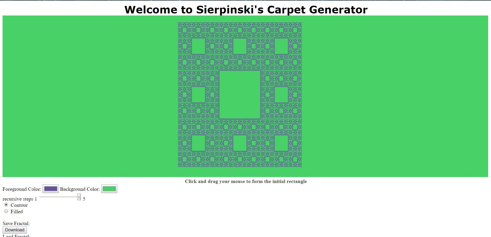

# Sierpinski-s-Carpet-Generator
This program requires some additional material provided in Source folder. I borrowed elements from proived materials in the example codes of course website.
To run the program just open up google chrome and drag and drop sierpinski.html file (after downloading all the files).
NOTE: The source folder includes some js files that I do not own. They are taken from Angel & Shreiner's example codes.

